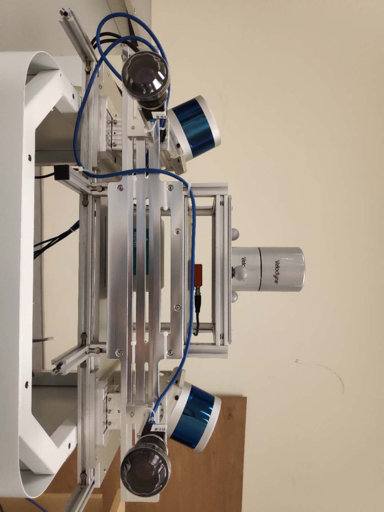

# Calibration IMU&Camera

## How to get camera intrinsic parameters?
-   There are two ways: 
1. By ROS, you can follow below tutorials:
    http://wiki.ros.org/camera_calibration/Tutorials/MonocularCalibration
2. By the toolbox: kalibr
    https://github.com/ethz-asl/kalibr

   Actually, when i use the toolbox, i met some problems. so i changed the original command to the following, the problems were solved:
   
   PS.  Building from source, had better not directly use smartphone bagfile as this tool is not applicable for smartphone.
   ```
   kalibr_calibrate_cameras --target data/april_6x6.yaml --bag data/2020-09-06-16-26-30.bag --bag-from-to 10 50 --models pinhole-radtan --topics /camera/image_color --show-extraction
   ```
   Notes (important) :  how to read the report?

## How to get IMU parameters?
 - By imu_utils, this package by gaowenliang(HKUST)
 https://github.com/gaowenliang/imu_utils

   The tutorial is not very clear, so i reference some blog: 
 https://blog.csdn.net/fang794735225/article/details/92804030

1. after downloading two packages: imu_utils, code_utils, then firstly put code_utils under src to compile, if successfull, then put imu_utils under same directory to compile;
1. next, record imu data for 2 hours;
2. calibrate imu by two steps(i choose xsens);
   
   rosbag play -r 200　filename.bag 

   roslaunch imu_utils x.launch


## How to calibrate IMU-Camera extrinsic parameters?
kalibr_calibrate_imu_camera --target data/april_6x6.yaml --cam cam.yaml --imu xsens_imu.yaml --bag data/2020-09-06-16-26-30.bag --bag-from-to 10 50 --show-extraction
- For reference: https://blog.csdn.net/u011178262/article/details/83316968
- Interestingly, I found that had better directly put xsens_imu.yaml, cam.yaml into src/ instead of data/, but you can put bag data and target file into data/, I do not why but it really works.

# My small sensor kit parameters:

<p align="center">
  
</p>


```
Camera intrinsic (by ros):
model_type: PINHOLE
camera_name: camera
image_width: 1920
image_height: 1200
camera intrinsic:
distortion_parameters:
   k1: -0.109203
   k2:  0.063536
   p1: -0.003427
   p2: -0.000629
projection_parameters:
   fx: 1086.160899
   fy: 1090.242963
   cx: 940.067502
   cy: 586.740077
```
```
IMU intrinsic(the following format needed change when use kalibr):
%YAML:1.0
---
type: IMU
name: xsens
Gyr:
   unit: " rad/s"
   avg-axis:
      gyr_n: 7.4476180445963098e-03
      gyr_w: 8.2775665766972293e-05
   x-axis:
      gyr_n: 7.2504888854417662e-03
      gyr_w: 8.7356692540001794e-05
   y-axis:
      gyr_n: 7.8258358855956486e-03
      gyr_w: 7.3688872009799617e-05
   z-axis:
      gyr_n: 7.2665293627515145e-03
      gyr_w: 8.7281432751115480e-05
Acc:
   unit: " m/s^2"
   avg-axis:
      acc_n: 8.1751044906501914e-03
      acc_w: 1.3084246540207204e-04
   x-axis:
      acc_n: 9.0886759513343560e-03
      acc_w: 1.3705658898071130e-04
   y-axis:
      acc_n: 8.2607696663920521e-03
      acc_w: 1.0905439458637021e-04
   z-axis:
      acc_n: 7.1758678542241635e-03
      acc_w: 1.4641641263913455e-04
```
```
extrinsic parameter between camera and imu:
```
```
cam0 (transformation from IMU to camera coordinates):
  T_cam_imu:
  - [-0.9980910026236224, -0.0015799642414101797, -0.06174021537674852, 0.054912613927649394]
  - [-0.06172758897811955, -0.007075633703491782, 0.998067953681833, 0.11622983489906714]
  - [-0.002013762826095295, 0.9999737192150048, 0.006964598954021748, -0.11470539005102824]
  - [0.0, 0.0, 0.0, 1.0]
  cam_overlaps: []
  camera_model: pinhole
  distortion_coeffs: [-0.109203, 0.063536, -0.003427, -0.000629]
  distortion_model: radtan
  intrinsics: [1086.160899, 1090.242963, 940.067502, 586.740077]
  resolution: [1920, 1200]
  rostopic: /camera/image_color
  timeshift_cam_imu: -0.02110350429911481
```

# Our lab sensorkit parameters:

<p align="center">
  
</p>

<p align="center">
  
</p>

1. IMU parameters:
   
 ```
#Accelerometers
accelerometer_noise_density: 7.8406254052472424e-03   #Noise density (continuous-time)
accelerometer_random_walk:   1.2967712609844757e-04   #Bias random walk

#Gyroscopes
gyroscope_noise_density:     7.4559162153988272e-03   #Noise density (continuous-time)
gyroscope_random_walk:       7.7056440035720022e-05   #Bias random walk

rostopic:                    /imu/data      #the IMU ROS topic
update_rate:                 200.0      #Hz (for discretization of the values above)

```

2.  Left camera intrinsic param and extrinsic param with respect to IMU: 
```
leftcamera intrinsic:
  cam_overlaps: []
  camera_model: pinhole
  distortion_coeffs: [-0.14185562666370247, 0.01553149264935834, 0.0035358753809967827,
    0.0022665268408541793]
  distortion_model: radtan
  intrinsics: [1352.6597178550837, 1370.243033801338, 770.238742546927, 633.5841615263967]
  resolution: [1920, 1200]
  rostopic: /left_camera/image_color

Imu transformed to leftcamera:
  T_cam_imu:
  - [0.9698686191774075, 0.2211808394762476, 0.10214645262314238, 0.00042125887490403196]
  - [0.0712076786769201, 0.1436089214377962, -0.9870693715139367, -0.0014538492762019737]
  - [-0.232989974102651, 0.9646012201589089, 0.1235320121895161, -0.00019286125782574484]
  - [0.0, 0.0, 0.0, 1.0]
  cam_overlaps: []
  camera_model: pinhole
  distortion_coeffs: [-0.14185562666370247, 0.01553149264935834, 0.0035358753809967827,
    0.0022665268408541793]
  distortion_model: radtan
  intrinsics: [1352.6597178550837, 1370.243033801338, 770.238742546927, 633.5841615263967]
  resolution: [1920, 1200]
  rostopic: /left_camera/image_color
  timeshift_cam_imu: -0.041354031903880546
```
3. Right camera intrinsic param and extrinsic param with respect to IMU: 

```
rightcamera intrinsic:
  cam_overlaps: []
  camera_model: pinhole
  distortion_coeffs: [-0.07527954079035452, -0.25121839583312516, 0.010575320479691909,
    0.006014166097368395]
  distortion_model: radtan
  intrinsics: [1328.5526527817062, 1363.1225245782555, 748.9659992133073, 625.2327375520196]
  resolution: [1920, 1200]
  rostopic: /right_camera/image_color

Imu transformed to rightcamera:
  T_cam_imu:
  - [0.989874534109872, 0.04589887531024018, -0.13431939534563567, 0.0043542093011745]
  - [-0.13516558455280892, 0.015844349277046588, -0.9906963315509363, -0.004290654068230252]
  - [-0.04334364397763087, 0.998820429227016, 0.021887866170515635, 0.0011439425862900465]
  - [0.0, 0.0, 0.0, 1.0]
  cam_overlaps: []
  camera_model: pinhole
  distortion_coeffs: [-0.07527954079035452, -0.25121839583312516, 0.010575320479691909,
    0.006014166097368395]
  distortion_model: radtan
  intrinsics: [1328.5526527817062, 1363.1225245782555, 748.9659992133073, 625.2327375520196]
  resolution: [1920, 1200]
  rostopic: /right_camera/image_color
  timeshift_cam_imu: -0.030317139821607345
```
```
### Contact
- Author: xiwei, PhD Candidate in Hong Kong Polytechnic University.
- Affiliation: [Intelligent Positioning and Navigation Laboratory](https://www.polyu-ipn-lab.com/)