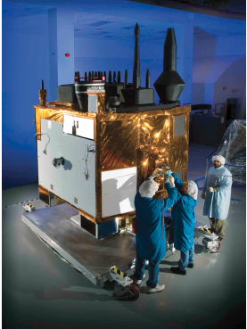
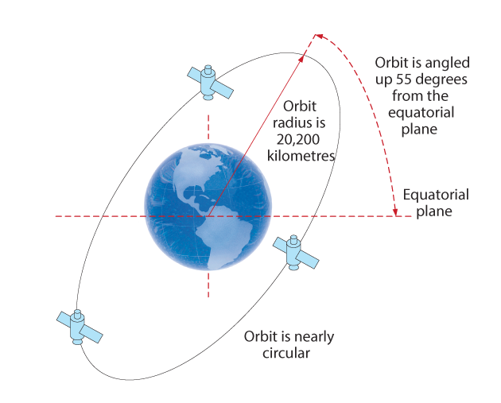

# GNSS Technique

## Abstract
This page summarize some technique details about GNSS technique.
## Content
### GNSS

- **GNSS Overview**
    - [GNSS Systems](https://www.novatel.com/an-introduction-to-gnss/chapter-1-gnss-overview/section-1/) 
    - [GNSS Signals and Positioning](https://www.novatel.com/an-introduction-to-gnss/chapter-1-gnss-overview/section-2/) 
    - [GNSS application, GNSS antenna and receiver, GNSS augmentation](https://www.novatel.com/an-introduction-to-gnss/chapter-1-gnss-overview/section-3/) 

- **Basic GNSS Concepts(satellite, propogation,Reception,Computation, Aplication)**
   

    
    

    - [Satellites](https://www.novatel.com/an-introduction-to-gnss/chapter-2-basic-gnss-concepts/step-1-satellites/) 
        - Notes:
            - above 20000km high 
            - moving very fast, several kilometers per second
            - last generation of GPS satellite (1400kg, 2.5mX2.0mX2.2m)
            - GPS L1 (1575.42MHz), L2(1227.60MHz) and L5(1176.45MHz)
        - Satellites
        - Satellites orbits
        - Satellite Signals
        - Satellite Errors
        - Satellite Lifetimes
        - Satellite Corrections 

    - [Propogation](https://www.novatel.com/an-introduction-to-gnss/chapter-2-basic-gnss-concepts/step-2-propagation/) 
        - Notes:
            - Ionospheric delay can be modeled 
            - tropospheric delay cannot be fully mitigated
            - Phase Center Stability
                - Time Kinematic (RTK) receivers that can achieve position accuracies of 2-4 cm, a few millimetres of phase center error can translate to a 10-15% error in reported position. For RTK survey applications, geodetic grade antennas offer superior PCO/PCV performance.
    

    
    

    
    - [Computation](https://www.novatel.com/an-introduction-to-gnss/chapter-2-basic-gnss-concepts/step-4-computation/) 
        - Dillution of precision:
            - the addition of a range measurement to a satellite that is angularly separated from the cluster allows us to determine a fix more precisely. 
            - Inaccuracy of Position Measurement =
            DOP x Inaccuracy of Range Measurement
            - A DOP above 6 results in generally unacceptable accuracies for DGNSS and RTK operations.
            - DOP can be used as the basis for selecting the satellites on which the position solution will be based; specifically, selecting satellites to minimize DOP for a particular application.
            - DOP varies with time of day and geographic location but, for a fixed position, the geometric presentation of the satellites repeats every day, for GNSS.
            - DOP can be calculated without determining the range. All that is needed is the satellite positions and the approximate receiver location. 
   

    
    

     - [Application](https://www.novatel.com/an-introduction-to-gnss/chapter-2-basic-gnss-concepts/step-5-application/) 
        - Once the errors have been accounted for in the GNSS equation, the receiver can determine its position and time, and pass this information on to the end user application. The GNSS technology market is a ubiquitous, multi-billion dollar industry. Applications range from simple hand-held metre-level navigation aids, to robust, centimetre-level positioning solutions for survey, unmanned and military. With users demanding GNSS positioning functionality in increasingly challenging environments, GNSS technology is being integrated with other sensors such as inertial technology to enhance positioning capabilities and dependability. 

- **Satellite Systems**
   

    
    

    - [Satellites](https://www.novatel.com/an-introduction-to-gnss/chapter-2-basic-gnss-concepts/step-1-satellites/) 
        - GPS (United States)
        - GLONASS (Russia)
        - BeiDou (China)
        - Galileo (European Union)
        - IRNSS reginal navigation satellite system (India)
        - QZSS reginal navigation satellite system (Japan)
    
    - [Satellites](https://www.novatel.com/an-introduction-to-gnss/chapter-2-basic-gnss-concepts/step-1-satellites/) 
        - [GPS](https://www.novatel.com/an-introduction-to-gnss/chapter-3-satellite-systems/gps/) (United States)
            - GPS was the first GNSS system. GPS (or NAVSTAR, as it is officially called) satellites were first launched in the late 1970sand early 1980s for the US Department of Defense. Since that time, several generations (referred to as “Blocks”) of GPS satellites have been launched. Initially, GPS was available only for military use but in 1983, a decision was made to extend GPS to civilian use.
 
            - Table: GPS Satellite Constellation
            
            | Satellites | 27 plus 4 spares |
            | :---:  | :---:  |
            | obital planes | 6 |
            | orbital inclination | 55 degrees |
            | orbit radis | 20200 km |

             

            
            

            - GPS satellites continually broadcast their identification, ranging signals, satellite status and corrected ephemerides (orbit parameters). The satellites are identified either by their Space Vehicle Number (**SVN**) or their Pseudorandom Noise (**PRN**) code.
            - Table: **GPS Signal Characteristics**
            
            | L1 | 1575.42 MHz | L1 is modulated by the C/A code (Coarse/Acquisition) and the P-code (Precision) which is encrypted for military and other authorized users.|
            | :---:  | :---:  |:---:  |
            | L2 | 1227.60 MHz	 |L2 is modulated by the P-code and, beginning with the Block IIR-M satellites, the L2C (civilian) code. L2C has begun broadcasting civil navigation (CNAV) messages and is discussed later in this chapter under “GPS Modernization”. |
            | L5 | 1176.45 MHz	 |L5, available beginning with Block IIF satellites, has begun broadcasting CNAV messages. The L5 signal is discussed later in this chapter under "GPS Modernization". |

            - **GPS Modernization**
            GPS reached Fully Operational Capability (FOC) in 1995. In 2000, a project was initiated to modernize the GPS space and ground segments, to take advantage of new technologies and user requirements.Space segment modernization includes new signals, as well as improvements in atomic clock accuracy, satellite signal strength and reliability. Control segment modernization includes improved ionospheric and tropospheric modelling and in-orbit accuracy, and additional monitoring stations. User equipment has also evolved, to take advantage of space and control segment improvements.
                - **L2C**
                The modernized GPS satellites (Block IIR-M and later) are transmitting a new civilian signal, designated L2C, ensuring the accessibility of two civilian codes. L2C is easier for the user segment to track and it delivers improved navigation accuracy. It also provides the ability to directly measure and remove the ionospheric delay error for a particular satellite, using the civilian signals on both L1 and L2. The L2C signal is expected to be available from 24 satellites by 2018.
                - **L5**
                The United States has implemented a third civil GPS frequency (L5) at 1176.45 MHz. The modernized GPS satellites (Block II-F and later) are transmitting L5.
                The benefits of the L5 signal include meeting the requirements for critical safety-of-life applications such as that needed for civil aviation and providing:
                    - Improved ionospheric correction.
                    - Signal redundancy.
                    - Improved signal accuracy.
                    - Improved interference rejection.
                The L5 signal is expected to be available from 24 satellites by 2021.
        - [BeiDou](https://www.novatel.com/an-introduction-to-gnss/chapter-3-satellite-systems/beidou/) (China)

- **GNSS Error Source**
   - Table: **GNSS System Errors**
            
        | Contributing Source | Error Range |
        | :---:  | :---:  |
        | Satellite Clocks | ±2 m |
        | Robit Errors | ±2.5 m |
        | Inospheric Delays	 | ±5 m |
        | Tropospheric Delays| ±0.5 m |
        | Receiver Noise	 | ±0.3 m |
        | Multipath/NLOS	 | ±0.3 ~100 m |

    - [Satellites](https://www.novatel.com/an-introduction-to-gnss/chapter-2-basic-gnss-concepts/step-1-satellites/) 
        - GPS (United States)

- **GNSS RTK**

    - **Tokyo University, Prof. Kubo**
        - [Precise and Robust RTK-GNSS Positioning in Urban Environments with Dual-Antenna Configuration](https://www.mdpi.com/1424-8220/19/16/3586)
        - [RTKLIB: An Open Source Program Package for GNSS Positioning](https://ieeexplore.ieee.org/document/7479746) [[Github](https://github.com/tomojitakasu/RTKLIB/tree/rtklib_2.4.3)] [[Manual](http://www.rtklib.com/prog/manual_2.4.2.pdf)] [[Tutorial Demo](http://www.rtklib.com/rtklib_tutorial.htm)]

    - **Tsinghua University, Prof. Lu mingquan**
        - [Precise and Robust RTK-GNSS Positioning in Urban Environments with Dual-Antenna Configuration](https://www.mdpi.com/1424-8220/19/16/3586)
    
    - **Wuhan University, Prof. Li Bijun**
        - [A Vision-assisted GNSS-RTK Ambiguity FixingMethod Considering Visual Lane Line Ambiguity](https://www.ion.org/plans/upload/PLANS20Program.pdf)
    
    - **Tongji University, TBD**
        - [A Vision-assisted GNSS-RTK Ambiguity FixingMethod Considering Visual Lane Line Ambiguity](https://www.ion.org/plans/upload/PLANS20Program.pdf)
    
    - **SJTU University, Prof. Li Bijun**
        - [A Graph Approach to Dynamic Fusion of Sensors](https://www.ion.org/plans/upload/PLANS20Program.pdf)
    
    - **Collections**
        - [Deep urban unaided precise GNSS vehicle positioning](https://arxiv.org/pdf/1906.09539.pdf)
        - [RTK: Where Every GNSS Matters](https://www.unoosa.org/pdf/icg/2014/wg/wgb10.pdf)

### Contact
- Author: [Weisong Wen](https://weisongwen.wixsite.com/weisongwen), PhD Candidate in Hong Kong Polytechnic University.
- Email: weisongwen@weisongwen
- Affiliation: [Intelligent Positioning and Navigation Laboratory](https://www.polyu-ipn-lab.com/)