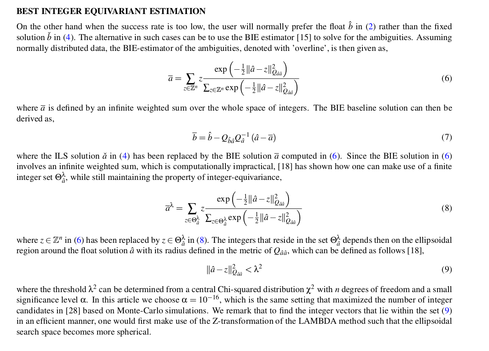

# On the Best Integer Equivariant Estimator for Low-cost Single-frequency Multi-GNSS RTK Positioning ([pdf](BIEestimator_1.pdf))

## Abstract
Carrier phase integer ambiguity resolution with a high success rate is the key to precise Global Navigation Satellite Sys-tem (GNSS) positioning. When the success rate is too low the user will normally prefer the float solution, whereas the alternative can be to use the Best Integer Equivariant (BIE) estimator. Low-cost receiver real-time kinematic (RTK) precise positioning has become possible through combining signals from several GNSSs, such as BDS, Galileo, QZSS, and GPS. In this contribution we will use single-frequency (SF) low-cost receiver multi-GNSS data to compare the performance of the BIE estimator and the standard method of Integer Least Squares (ILS). The GNSS data is evaluated in Dunedin, New Zealand, with short baselines so that the relative atmospheric delays can be neglected. We show, with real multi-GNSS data
and when the success rate is at low to medium levels, that the positioning performance of the BIE estimator will resemble or be better than that of the float solution, and always be better in the minimum mean squared error (MMSE) sense than the ILS fixed solutions. Whereas for very high success rates we get a BIE performance similar to that of the ILS estimator and much better than the float solution

**Authors**
Robert is currently a Senior Lecturer at the School of Surveying, University of Otago. Robert is a member of the Inter-national Association of Geodesy (IAG) ICCT Joint Study Group ’Multi-GNSS Theory and Algorithms’, and is a co-chair of the IAG working groups on ’Reliability of low-cost & Android GNSS in navigation and geosciences’ and ’Ambiguity resolution for low-cost GNSS receiver positioning’, respectively.

Peter J.G. Teunisse  is currently a Professor of geodesy and navigation, and the Head of the GNSS Research Centre at Curtin University. He is also with Department of Geoscience and Remote Sensing, Delft University, Delft, The Nether-lands. His current research interests include multiple GNSSs and the modeling of next-generation GNSS for high-precision positioning, navigation, and timing applications.

  

## comments
This is the work from Prof. Peter J.G. Teunisse. Instead of get the integer solution based on the conventional LAMBDA algorithm, this paper proposes to weighting average over the several possible float solutions.

**Advantage**: 
when fix rate is high, similar performance is obtained, compared with the conventional LAMBDA algorithm.
when the fix rate is low, better performance is obtained, compared with the conventional LAMBDA algorithm.
**Question**: 
- Q1: 